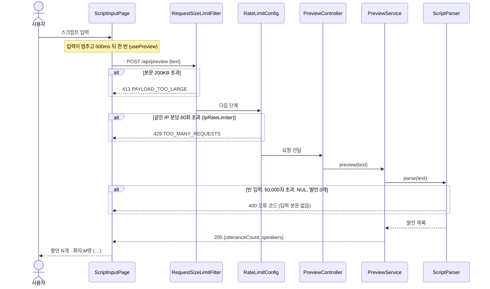
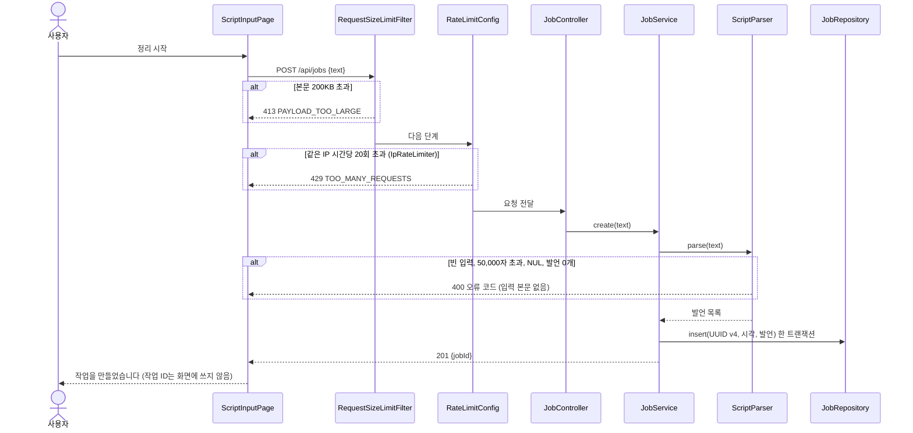
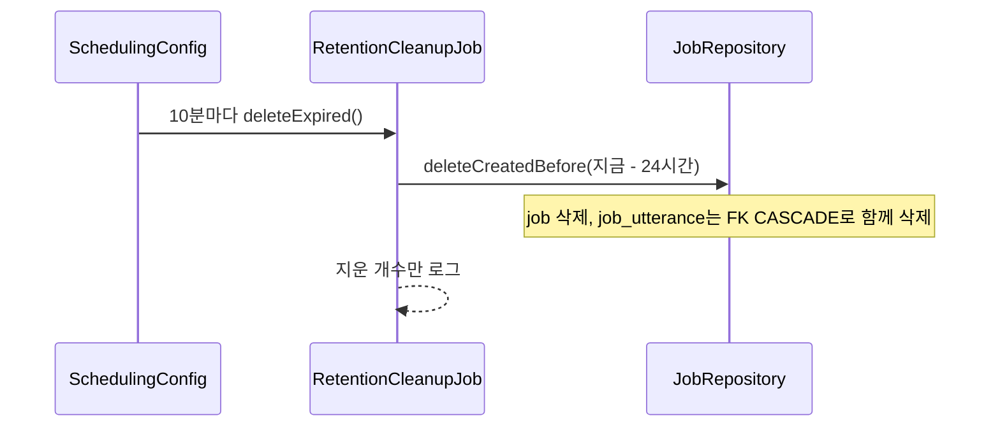

# 아키텍처

## 구조

```
[React (Vite)] ──REST /api──> [Spring Boot API]
  features/input                 ├─ common  : 오류 응답, 요청 본문 상한 필터, IP 요청 수 제한, CORS, JSON 변환, 시계·스케줄
  api/client                     ├─ minutes : 입력 검사·분할(발언 번호), 미리보기, 작업 생성, 보관 기간 삭제
                                 ├─ llm      (예정, F2) : LlmClient ← Ollama / Claude / Fixture
                                 ├─ evidence (예정, F2·F3) : 근거 위치 검증(코드), 검증 단계 호출, 판정 합치기
                                 └─ export   (예정, F5) : docx 생성
                              [DB] H2 파일 DB + Flyway: 작업(job)·발언(job_utterance). 결과 저장은 F2부터
```

- PWA 설치 구성(manifest, 서비스 워커)은 예정이다.
- 개발 중 프론트는 같은 출처의 `/api`를 부르고, Vite 프록시가 백엔드(`127.0.0.1:8080`)로 넘긴다.

## 패키지 구성

### 백엔드 (`backend/src/main/java/tracenotes`)
| 패키지 | 클래스 | 역할 |
|---|---|---|
| `common` | `RequestSizeLimitFilter` | 요청 본문 200KB(204,800바이트) 상한, 넘으면 413 |
| | `RateLimitConfig`, `IpRateLimiter`, `RateLimitProperties` | IP별 요청 수 제한 (미리보기 분당, 작업 생성 시간당), 넘으면 429 (ADR 0006) |
| | `ApiError`, `ApiExceptionHandler` | 공통 오류 응답. 코드와 고정 문구만, 입력 본문·예외 메시지 없음 |
| | `AppProperties` | 글자 수·바이트 상한, CORS 허용 주소 설정과 시작 시 검증 |
| | `CorsConfig`, `JsonConfig`, `ClockConfig`, `SchedulingConfig` | CORS, JSON 읽기 오류의 입력 숨김, 시계 빈, 스케줄 켜기 |
| `minutes` | `ScriptParser` | `ScriptValidator`(빈 입력·50,000자·NUL) → `ScriptSplitter`(발언 분할) → 발언 0개 거부. 미리보기와 작업 생성이 같이 쓴다 |
| | `PreviewController`, `PreviewService` | `POST /api/preview` → `{ utteranceCount, speakers }`, 저장하지 않음 |
| | `JobController`, `JobService`, `JobRepository` | `POST /api/jobs` → 201 `{ jobId }`, 작업과 발언을 한 트랜잭션으로 저장 (JdbcTemplate batch) |
| | `RetentionCleanupJob`, `RetentionProperties` | 보관 기간(기본 24시간)이 지난 작업 삭제, 발언은 FK CASCADE로 함께 삭제 |

### 프론트엔드 (`frontend/src`)
| 위치 | 역할 |
|---|---|
| `api/client.ts` | `/api` 호출, 알려진 오류 코드만 받음, 응답 형식 검사 |
| `features/input/ScriptInputPage.tsx` | 입력 화면: 입력란, txt 파일 열기, 요약 줄, 정리 시작 |
| `features/input/usePreview.ts` | 500ms 디바운스 후 미리보기 (React Query) |
| `features/input/readScriptFile.ts` | 파일 검사(확장자·200KB·NUL)와 UTF-8 → EUC-KR 판별 |
| `features/input/messages.ts`, `limits.ts`, `scriptLength.ts` | 고정 안내 문구, 상한 값, 서버와 같은 글자 수 계산 |

## 주요 흐름

### 미리보기 (F1)


### 작업 생성 (F1)


### 보관 기간 삭제 (F1, S2)


## 전체 처리 흐름 (F2 이후 포함)
1. 스크립트 입력 → 발언 단위 분할, 번호 부여 (F1, 구현됨)
2. 정리 단계: LLM이 회의록 항목 + 근거 발언 번호를 JSON으로 반환 (예정)
3. 코드 검증: 발언 번호 존재 여부 확인, 없는 근거 제거 (예정)
4. 검증 단계: 다른 프롬프트로 항목과 근거 발언 대조 → 판정 (예정)
5. 검토 화면: 사용자가 항목 수정·삭제·유지 → 확정 (예정)
6. 내보내기: 확정 내용만 docx로 (예정)

## 결정 기록
- docs/adr/ 참고
